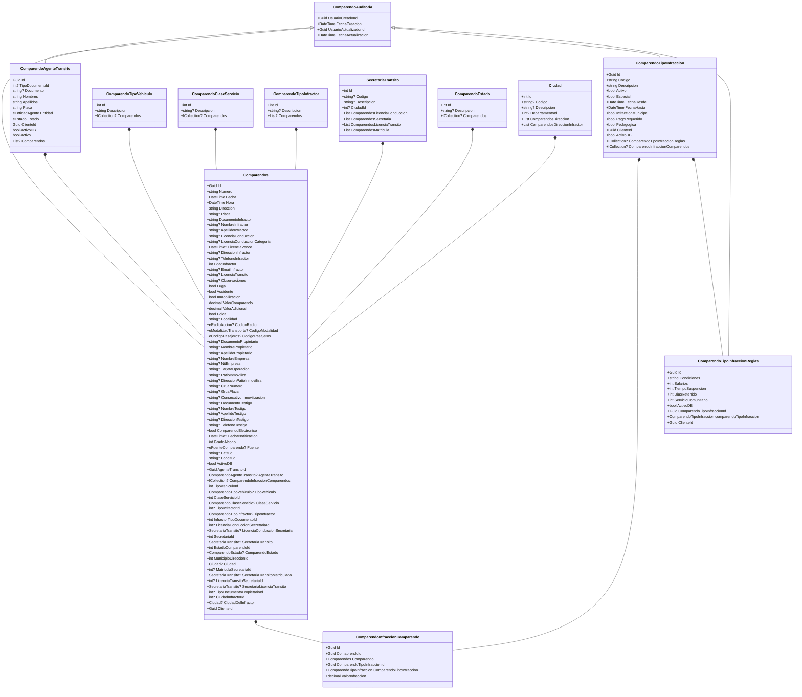

# Aplicación para Migrar y Generar los Comparendos en estándar Simit

## Objetivos del Programa

1. Migrar los comparendos desde la base de datos **SystransNegocio28072023PruebasRunt** adaptando los datos guardados en esta base de datos a formato Simit para guardarlos a la base de datos **Systrans3**.
2. Migrar los comparendos desde un **Archivo Plano** en Estandar Simit a la base de datos **Systrans3** (Esta funcionalidad se encuentra comentada en la parte inferior de **Program.cs**).
3. Generar **Archivo Plano con Estandar Simit** con nombre **código del organismo de tránsito seguido de comp** para exportar los comparendos desde **Systrans3** a **Simit**.

## ¿Qué hace el programa?

Tiene principalmente dos funcionalidades migrar comparendos en Estandar Simit a Systrans3 y exportar los comparendos guardados por Systrans3 a archivo plano con el Estandar definido por Simit generando también el registro de control.

## Cómo ejecutar el programa

1. Verificar la versión de .NET para poder reconstruir el proyecto, ver el archivo **global.json** donde se encuentra la versión del .NET en este caso es **.NET 7.0.305**.
2. Clonar el repositorio
```
git clone <URL_del_repositorio> <nombre_de_directorio_local>
```
3. Reconstruir el proyecto después de clonarlo desde git, ubicarse en la carpeta raiz donde se encuentra el archivo de **solución sln** y utilizar el siguiente comando con el fin de instalar librerias que se encuentran en los **archivos .csproj** de cada proyecto.
```
dotnet restore
```
4. Compilar el siguiente comando para compilar la aplicación y ver las advertencias y errores de la aplicación.
```
dotnet build
```
5. Ejecutar la aplicación de consola (capa de presentación), abrir la aplicación de consola mediante el **CMD**.
```
dotnet run
```

## ¿Cómo hacer el proceso de migración de comparendos?

El programa en la capa de presentación es una aplicación de consola por lo tanto para simular una funcionalidad se pide el **número de la opción** en este caso para migrar los datos desde la base de datos **SystransNegocio28072023PruebasRunt** a **Systrans3** digital en consola el número **1**, **recuerde**, para migrar los datos desde un **archivo plano** toca reemplazar el código que se encuentra comentado por el que no está comentado **El archivo plano de simit hay que pegarlo en 05.Comparendo.Presentación.Consola/Data/25754000comp.txt**, pero va a migrar los datos desde **SystransNegocio28072023PruebasRunt** a **Systrans3** no es necesario hacer nada.

## ¿Cómo exportar los comparendos a archivo plano Estandar Simit?

El programa en la capa de presentación es una aplicación de consola por lo tanto para simular la funcionalidad de generar archivo plano en estandar Simit es requerido eliminar todos los archivos txt que se encuentran en la ubicación **05.Comparendo.Presentación.Consola/Data/25754000comp.txt** con el nombre **25754000comp.txt** para no generar sobre escritura en ese archivo txt sino generar uno **nuevo**.
La aplicación de consola pide digitar una opción en número, en este caso para exportar los comparendos se requiere especificar en **Program.cs**, el **En una lista de  ComparendoRequestDto el ID y el código de la infracción para exportar el comparendo** a archivo plano, el archivo se genera en **05.Comparendo.Presentación.Consola/Data/25754000comp.txt**.

## ¿Cómo salir del programa?

**Para salir del programa escoger la opción 3**

## Estructura de la aplicación (Arquitectura Limpia)

La aplicación se ha desarrollado con **Arquitectura Limpia** eso quiere decir que la aplicación tiene 4 capas para dividir las tareas **Capa de Dominio, Capa de Aplicación, Capa de Infraestructura, Capa de Presentación**.

## Capa de Dominio

La capa de dominio es un **classlib** contiene las **entidades** que están relacionadas con la tabla de **comparendos** o en este caso con la entidad de comparendos, **Es importante resaltar que se ha implementado varias propiedades que recomienda el Entity Framework para poder generar las relaciones y hacer operaciones con entidades relacionadas**, en la siguiente imagen se muestra el **diagrama de clases** que representa practicamente una forma similar el diagrama entidad relación de las tablas de la base de datos de **Systrans3**.



## Capa de Aplicación (Capa de Casos de Uso)

En esta capa se gestionan las acciones relacionadas con las reglas de negocio. **Por ejemplo, al considerar la creación de un comparendo, se definen diversas acciones en función de los requisitos. Esto implica verificar la existencia de un agente de tránsito; si no existe, se procede a crear uno. Se verifica la existencia de un código de infracción, y así sucesivamente. Cada acción se ejecuta secuencialmente para lograr el objetivo final la creación del comparendo**.

### Implementación del patrón de diseño CQRS

Con este patrón se busca separar las operaciones de Creación, Actualización y Eliminación de Comparendos con las operaciones de lectura

- **Commands**
La única operación que se empleará es la de **crear** comparendos, además se definen los Commands.

- **Querys**
Se va a utilizar unicamente la operación de **Consultar** comparendos, aquí se definen los Dtos.

### Implementación del patrón Mediator

Para implementar el patrón mediator se requiere definir las funciones handler tanto en los **Commands** y los **Querys** que reciben la información de acuerdo a los tipos de datos.

### Definición de los Contratos mediante interfaces de los repositorios

Se han definido cuatro contratos específicos: **IComparendoAgenteTransitoRepository**, diseñada para realizar consultas relacionadas con los agentes de tránsito; **IComparendoInfraccionComparendo**, destinada a gestionar la relación de muchos a muchos entre comparendos e infracciones. Estos dos contratos proporcionan las reglas necesarias para establecer relaciones efectivas en la creación de comparendos, a través de los contratos de **IComparendoRepository**. Además, se ha establecido **IComparendoTipoInfraccionRepository** para la consulta de infracciones y poder generar las relaciones necesarias para la creación de comparendos.

### Extensions

Se ha implementado diferentes tipos de castings entre los tipos de datos.

### Utils

Se ha definido una metodología para generar las repuestas del 

## Capa de Infraestructura (Persistencia)

Esta capa tiene la responsabilidad de implementar los contratos de la capa de aplicación, y de definir las reglas en el DataContext. Esto permite inicializar las entidades y realizar operaciones comunes en la base de datos.

## Capa de Infraestructura

En esta capa se definen los mappers de la aplicación y algunas validaciones para generar una excepción en caso de no cumplir los requisitos de negocio para poder crear o consultar comparendos.

## Capa de Presentación (Aplicación en Consola)

Esta capa no es importante (Puesto que es la única parte que puede ser reemplazada por una aplicación web).

- El objetivo de esta capa es generar una simulación de ingreso de datos con estandar Simit por lo tanto se definen las siguientes carpetas:
	- Data: se definen las diferentes vistas y entidades de la base de datos **SystransNegocio28072023PruebasRunt** para obtener Comparendo, Código de Infracción, Localidad, Tipo de documento, Agente, Direccion, Licencia de Conducción y Persona, por otro lado en esta carpeta se genera los archivos planos.
	- Extension: Define la cadena de la base de datos **Systrans3** y **SystransNegocio28072023PruebasRunt**, también se definen los ciclos de vida de las inyecciones de dependencias con los contratos con sus implementaciones, se define la estructura simit de cada linea del archivo plano de simit cuando se va a generar el archivo plano de Simit, incluye el conversor de String a ASCII para generar los registros de control del archivo plano.
	- Helpers: se define la simulación de una páginación para traer los comparendos de la base de datos **SystransNegocio28072023PruebasRunt** y poderlos listar todos sin que el query genere algún error por la cantidad de datos.
	- Logic: es la carpeta donde se simula un controlador de la página web, creación de archivos y lectura de archivos.
	- Models: Se definen las entidades de comparendos **SystransNegocio28072023PruebasRunt** para generar los comparendos y simular el estandar de Simit.
	- Repository: Utilizar el patrón repository para generar consultas en la base de datos **SystransNegocio28072023PruebasRunt** sobre los comparendos y convertir los datos en estándar Simit.
	- Program.cs: Este archivo es el inicio de toda la aplicación, se ha programado las opciones para escoger: 
	1. Migrar datos de Simit a Systrans3
	2.  Exportar datos de comparendos a formato Simit.
	3.  Salir del programa.
